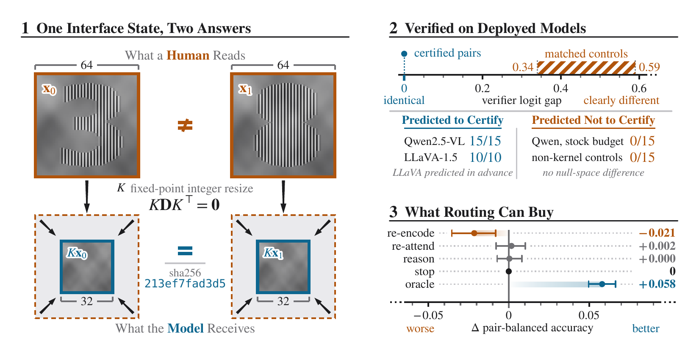
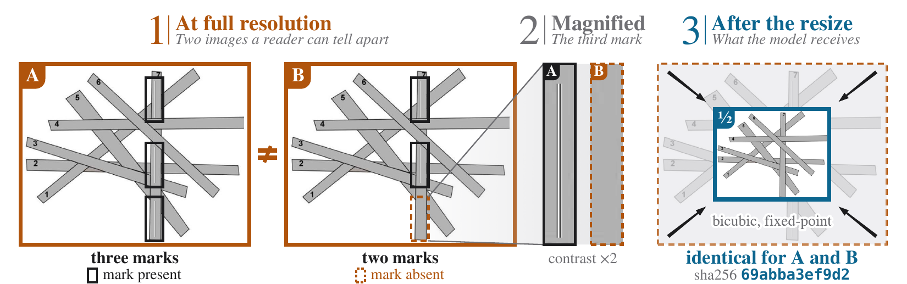

<div align="center">

# Certified Interface Aliases

### Exact Collisions in Vision&ndash;Language Preprocessing, and When They Exist

**Mert Onur Cakiroglu**<sup>1</sup> &middot; **Elham Buxton**<sup>2</sup> &middot; **Mehmet Dalkilic**<sup>1</sup> &middot; **Hasan Kurban**<sup>3</sup>

<sup>1</sup>Indiana University Bloomington &emsp; <sup>2</sup>University of Illinois Springfield &emsp; <sup>3</sup>Hamad Bin Khalifa University

[](https://arxiv.org/abs/2609.33003)
[](https://www.python.org/)
[](https://pytorch.org/)
[](https://github.com/huggingface/transformers)

</div>

<p align="center">
  
</p>

**AliasForge** constructs pairs of images that have opposite correct answers but reach a
vision&ndash;language model as bit-identical tensors. Fixed-point resampling makes the resize an
exact integer linear map, and AliasForge hides a label-flipping perturbation in the integer null
space of that map. A pair is certified when a single SHA-256 digest of every field the image
processor emits, covering array contents, data types, shapes and metadata, matches across its two
members. Every verifier then has the same output law on both members, so its pair-balanced
accuracy is exactly one half and language-side repair gains nothing.

This repository contains the AliasForge library, a CPU-only certificate check, every experiment in
the paper, the per-item records behind each reported number, and the scripts that recompute those
numbers from the records.

## Highlights

- **A certified measurement instrument.** Certified pairs on three architectures (Qwen2.5-VL-7B,
  LLaVA-1.5-7B and the tiled VisualPRM-8B pipeline) and on four additional processors. The
  decision-logit gap is exactly zero on all 18 scored pairs and on none of the 18 controls.
- **Constructibility from the resize alone.** Every fixed-point downscaler has integer null vectors
  (Theorem 7). At 2&times;, 1.5&times; and 4/3&times; the theorem bounds their size at
  any support width, and a bound above 255 rules out an 8-bit collision. Without model weights or
  queries, a lattice criterion (Proposition 10) resolves all twenty screened
  configurations, seventeen as constructible and three as not.
- **A screen and a ceiling for compute routing.** Certified pairs flag routers that spend compute on
  re-attention or further reasoning where it provably cannot help (Corollary 5). On
  1,280 natural VisualProcessBench items the split-sample routing value is V = 0.056 over the best
  fixed action, yet no tested interface-only router improves on stopping. The fiber ceiling
  (Proposition 6) bounds how much of that value a router reading only the
  preprocessed image can recover.

<p align="center">
  
</p>
<p align="center"><em>A certified pair on a MathVision image. Member A contains three marks and member B two, so
the correct counts differ, yet after the 2&times; resize the two tensors are bit-identical.</em></p>

## Quick start

The certificate check runs on a CPU and needs only Python 3 with numpy and Pillow. It uses no
model weights and no datasets.

```bash
git clone https://github.com/KurbanIntelligenceLab/aliasforge.git
cd aliasforge
pip install numpy pillow

python verify/verify_certificate.py                          # bicubic, 896 -> 448
python verify/verify_certificate.py --n-in 1344 --n-out 448  # bicubic, 1344 -> 448 (about a minute)
python verify/verify_certificate.py --kernel lanczos         # Lanczos, 896 -> 448
```

`verify_certificate.py` reconstructs the deployed fixed-point resize and confirms that it
reproduces Pillow byte for byte. It then computes, in exact rational arithmetic, a certified lower
bound on the size of any nonzero integer kernel vector. When the bound exceeds 255 the configuration
is reported as not constructible. Otherwise the script builds a pair and checks that the two
resized tensors are identical.

| Filter | Resize | Expected verdict |
|---|---|---|
| bicubic | 896 &rarr; 448 | constructible, resized pair identical |
| bicubic | 1344 &rarr; 448 | constructible, resized pair identical |
| Lanczos | 896 &rarr; 448 | not constructible |

Three further checks accompany the theory.

| Command | What it checks |
|---|---|
| `python verify/polyphase_check.py` | Theorem 7 on the reconstructed operators: the bound &beta;(K), the generator and &beta;(K)/M at 2&times;, 1.5&times; and 4/3&times; (Table A1) |
| `python verify/verify_theory.py` | the formal statements, by exhaustive enumeration on small cases and Monte Carlo on random instances |
| `OMP_NUM_THREADS=1 python verify/library_transfer.py` | which resize modes of the installed image libraries reproduce a collision bit for bit (Appendix D) |

On macOS, if `library_transfer.py` aborts because two OpenMP runtimes are loaded, run it with
`KMP_DUPLICATE_LIB_OK=TRUE`.

## Reproducing the paper's results

Every statistic in the paper can be recomputed on a CPU from the records in `results/`. The
analysis scripts also need scikit-learn, and they write their output to `analysis/output/`. Run
them from the repository root. [`results/README.md`](results/README.md) maps each record directory
to the experiment that produced it and to its place in the paper.

```bash
python analysis/e1_gate.py --glob 'results/routing/e21-pathmatched/sh_*.csv'        # routing value (Section 7, Table A8)
python analysis/e1_action_ci.py --glob 'results/routing/e21-pathmatched/sh_*.csv'   # per-action gains, both replicates
python analysis/e3_table.py                                                         # Table 2
python analysis/e34_intervals.py && python analysis/make_router_table.py            # Table A9, vision-tower routers
python analysis/e35_intervals.py                                                    # Tables 2 and A9, hidden-state routers
python analysis/per_source.py                                                       # Table A10 (after e34_intervals.py)
python analysis/a1_errors.py && python analysis/make_a1_table.py                    # Table A11
python analysis/cost_sensitivity.py                                                 # cost sweep (Appendices F and G)
python analysis/power_observed.py                                                   # Appendix H (a few minutes)
python analysis/make_kernels_table.py                                               # Table A3
python analysis/make_screen_table.py                                                # Table A4
python analysis/make_breadth_table.py                                               # Table A5
python analysis/e27_summary.py 'results/constructibility/e27-kernelswap/sh_*.csv'   # Lanczos kernel swap
```

## Re-running the experiments

Re-running an experiment needs a GPU and the full environment.

```bash
conda env create -f environment.yml
conda activate aliasforge
```

Each experiment is a Python script with a shell wrapper in `experiments/<group>/`. A wrapper reads
four environment variables. `DATA_DIR` holds the model weights under `models/` and the benchmark
under `datasets/`, `OUT` is the output CSV and `TASK_ID` the shard index. `ITEM` is one line of a
list in `configs/`, for the wrappers that iterate over one. The scripts in `experiments/setup/`
download the models, processors and benchmark into `DATA_DIR`, and `VERSIONS.md` pins every model,
dataset and library version used in the paper.

```bash
export DATA_DIR=/path/to/data OUT=out/sh_0000.csv TASK_ID=0
ITEM=Qwen/Qwen2.5-VL-7B-Instruct bash experiments/setup/fetch_models.sh
bash experiments/certification/e0a_exact.sh
```

## Repository layout

| Path | Contents |
|---|---|
| `src/aliasforge/` | the library: exact resampling, the integer kernel lattice, interface hashing, repair actions, the verifier harness and metrics |
| `verify/` | the certificate check and the numerical checks of the formal statements |
| `analysis/` | scripts that compute the reported statistics from `results/` |
| `experiments/` | the experiments in four groups (`certification`, `constructibility`, `natural_images`, `routing`), and download scripts in `setup/` |
| `configs/` | the models, processors, resize configurations and routes the wrappers iterate over |
| `results/` | per-item records, grouped like `experiments/`, with an index of where each appears in the paper |
| `tests/` | unit tests of the invariants the experiments rely on |

## Responsible use

Certified aliases are a measurement instrument, but the same construction could be used to evade
moderation or safety verifiers. Image-scaling attacks and their defenses are already public, and
aliases for a known preprocessing pipeline are inexpensive to regenerate, so we release the
constructor together with tools for defenders. `verify/verify_certificate.py` reports whether a
resampling filter and resize ratio admit realizable collisions. Switching the filter is one
mitigation: Lanczos resampling admits no realizable interior carrier at 2&times; (Table A1),
and in `results/constructibility/e27-kernelswap` the swap from bicubic breaks all four tested pairs
while changing the verifier's mean correctness on the 1,280 natural items by only +0.0002 (95%
interval [&minus;0.0007, +0.0011]).

## Citation

```bibtex
@misc{cakiroglu2026certified,
  title         = {Certified Interface Aliases: Exact Collisions in Vision-Language Preprocessing, and When They Exist},
  author        = {Mert Onur Cakiroglu and Elham Buxton and Mehmet Dalkilic and Hasan Kurban},
  year          = {2026},
  eprint        = {2609.33003},
  archivePrefix = {arXiv},
  primaryClass  = {cs.CV},
  url           = {https://arxiv.org/abs/2609.33003}
}
```
